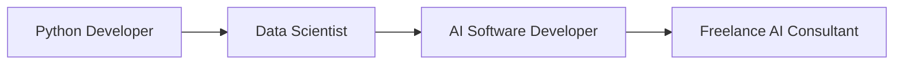

# Hi there, I'm Carmen Cruzado 👋

[](https://www.linkedin.com/in/carmen-cruzado)
[](mailto:carmencruzado97@gmail.com)
[](https://replicate.com/carcruz97)
[](https://medium.com/@carcruz97)

## About Me 🚀

The pandemic turned me into a Python Developer, my first corporate role evolved me into a Data Scientist, and the freelance world shaped me into an AI Software Developer. I'm essentially a trendy programmer who pieces together models from academic papers and GitHub repositories!

## What I Do 💻

- 🤖 AI & ML Engineer specialized in Computer Vision and GenAI
- 🌱 Helping startups grow through SOTA tech solutions
- 📊 Experienced in Credit Scoring and NLP
- 🛠️ MLOps enthusiast

## Tech Stack 🔧

```python
tech_stack = {
    "Languages": ["Python", "Bash"],
    "ML/DL": ["PyTorch", "TensorFlow", "Hugging Face", "Scikit-Learn"],
    "Cloud": ["Google Cloud Platform", "AWS", "Azure"],
    "Tools": ["Docker", "Kubeflow", "Git"],
    "Interests": ["Computer Vision", "LLMs", "LLaVAs", "MLOps"]
}
```

## Recent Projects 🎯

- 🌾 Developed credit scoring models for Agro-Fintech
- 💰 Built a Gemini-based categorization engine for personal finance
- 🏠 Created AI models for virtual staging and room scaling
- 📄 Implemented intelligent document extraction systems

## Beyond Code 🌟

When I'm not coding, you'll find me:
- 🚴‍♀️ Cycling around the city
- 🎧 Getting inspired by tech podcasts
- 💪 Crushing CrossFit workouts
- 🌍 Meeting new people at Mundo Lingo events

## Professional Journey 📈



## Let's Connect! 🤝

I'm always interested in collaborating on innovative AI projects or discussing the latest tech trends. Feel free to reach out!
